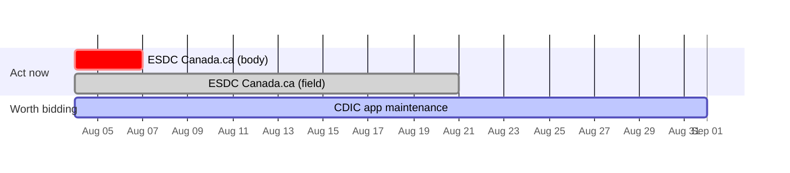

# Tender briefing

Write to `vault/briefings/briefing-YYYY-MM-DD.md`, dated today. Never print the
briefing to the terminal — it gets read in Obsidian, and wide tables
truncate in a terminal.

Read `vault/profiles/my-company.md` and `vault/reference/vehicles.md`
first. The profile decides fit; the vehicles file decides eligibility.

Then read the corpus end to end with `list-corpus`, which returns every
notice ordered by closing window. Don't survey with `search` — it ranks
against a query and returns n, which answers a different question — and
don't read ChromaDB directly. Read the `provenance` block it returns
before anything else, and report it (see Rules).

## Structure

Open with an H1 naming the week, then two lines summarising what needs
action. Obsidian previews the first lines of a file in its list view —
that summary is how a reader scans months of briefings without opening
them.

**1. Act now**
Things with a clock: `closing_window: imminent`, and any
`closing_date_conflict`. A body deadline earlier than the field is the
costliest error in the corpus — lead with it and quote the notice.
Absence of a conflict key means none was detected, not that the date
was verified.

`closing_window` is derived per query from `closing_date` against the
profile's `imminent_within_days`, so it is correct on the day you write
rather than the day of the ingest. Get it from `list-corpus` or `get`;
it is not stored in the corpus. A `closed` window means the notice
expired since the ingest — say so, don't list it as open.

**Nothing goes in this section that doesn't need a decision this
week, and imminent is not the same as actionable.** Most weeks a dozen
or more notices are imminent and nearly all are call-ups against a
vehicle not held, product buys or staff augmentation. Those go to
section 5 under their failure class exactly as they would at any other
closing date — putting them here replaces an empty section with a
useless one. Section 1 takes imminent notices that would otherwise be
worth acting on, plus every conflict.

**Report the imminent count either way**, including when none of them
are actionable. A verified zero and an unexamined zero read the same
on the page, and only one of them is worth anything in three months.

**2. Closing soon, no action**
Closing within 14 days but *not* imminent, and not actionable. One
collapsed callout with a table inside. A reader who wants to confirm
nothing was missed can open it; nobody has to scroll past it.

**3. Worth bidding**
The short list. For each: what the work actually is, why it fits, and
the disqualifying facts stated plainly rather than implied —
clearance, set-asides, incumbency, Canadian content weighting. If a
tender stretches the profile, name which capability it stretches and
quote the profile against the notice.

**4. Vehicles**
Cross-reference `vault/reference/vehicles.md`. Report qualification
notices open now, and how many notices this week were gated behind a
vehicle not held. Record the gating count even when it's zero — a
verified zero is what makes the comparison meaningful in three months.

For vehicles already declined in `vehicles.md`, reference rather than
restate: one line saying how many are open again and pointing at the
file. Don't re-argue a decision that's already recorded.

**5. Skip**
Grouped by failure class, not listed flat. The classes that recur:
product or SaaS purchase, call-up against a vehicle not held, staff
augmentation, results notice with nothing to bid, out of domain,
non-federal. One line each. Collapsed.

**6. Pre-RFP signals**
Closed RFIs and summary reports. Nothing to submit, but they name
requirements that haven't been competed yet. Say which department and
which program.

## Presentation

Use Obsidian callouts. They're native, need no plugins, and degrade to
plain blockquotes anywhere else.

```
> [!danger] Closes Friday, not the 21st
> The body states 2026-08-07 at 14:00 EDT.

> [!warning]- Weak basis — confirm against the notice
> Classified on "TBIPS" in a title, no arrangement number cited.
```

A trailing `-` collapses the callout by default. A trailing `+` leaves
it expanded but foldable.

| Callout | For |
|---|---|
| `danger` | date conflicts, anything `imminent` |
| `tip` | worth bidding |
| `warning` | stretches, weak `kind_basis`, confirm-before-acting |
| `failure` | gated behind a vehicle not held |
| `info` | recorded, no action needed |
| `quote` | text quoted from a notice |

**Colour by instrument state, never by fit.** "Gated behind TBIPS" is
a fact about the notice. "Strong match" is a judgment, and rendering a
judgment as a colour is a rating scale wearing a costume. There is no
`success` callout in that table for the same reason — it implies a
verdict the reader hasn't reached yet.

**Collapse by default:** section 2, section 5, the declined-vehicles
line, and any table over six rows. Expand by default: sections 1, 3
and 4.

**A closing-date timeline** is worth including when three or more
notices close within the briefing window. Dates are facts, so this
adds no judgment — and a `closing_date_conflict` renders as two bars
for one notice, which makes the anomaly visible rather than described.

````

````

Use `crit` for date conflicts and the `imminent` window, `active` for
the worth-bidding set, `done` for everything else. Don't put the skip
list on it, and leave `standing` notices off entirely — a placeholder
year renders as a bar running off the chart.

**No emoji status markers.** They age badly and read as noise at
length.

## Rules

**Report corpus provenance, and never infer it from file timestamps.**
`list-corpus` returns a `provenance` block: `corpus_built_at` and
`feed_downloaded_at` as recorded by the ingest, the same two from the
newest digest, and a `state`. State them in the briefing. If this
machine's feed stamp is behind the digest's, say so and say plainly that
the briefing cannot see anything the newer corpus holds — the reader's
fix is `git pull` then `python scripts/ingest.py`.

`chroma_db/` mtimes are **not** evidence of anything: ChromaDB rewrites
its segment files on every read, so they report when you last queried.
A briefing that dates the corpus from them is describing its own read,
and one already did.

**A fresh `corpus_built_at` is not a fresh briefing.** A corpus rebuilt
off an unchanged `.cache/tenders.csv` has a new build stamp and the old
feed stamp; the data is exactly as old as it was. When the two digests
agree on the feed but not the build, any change in what's in the corpus
is a filter or profile effect — never report it as new notices.

**`unstamped` and `no_feed_at_build` are different findings.** The first
means the corpus predates stamping and a rebuild will date it. The
second means it was built with no cached feed, so its data cannot be
dated and a rebuild alone will not help. Don't collapse them.

**Wikilink only tenders that exist in the vault** — `watching/`,
`parked/` or `archived/`. Everything else is plain text with the ID.
Fifty unresolved links per briefing makes the graph unreadable and
hides what's actually being tracked.

**Read the descriptions.** Product buys file as `*SRV` and type as
Request for Proposal. Nothing structural separates a SaaS purchase
from a services engagement in this feed — the classifier can't and
shouldn't try. Catching them is the job of reading.

**State the basis when it's weak.** `kind_basis:
procurement_category_residual` means solicitation is what's left over,
not a positive finding. `prose_vehicle_name` means the vehicle was
inferred from a title, not a cited arrangement number — flag those for
confirmation.

**`unrecognised` is not `non_federal`.** Federal Crown corporations —
CDIC, BDC, Canada Post — have no entry in a registry of departments. A
registry miss is not evidence of anything. Never treat it as a reason
to skip.

**Never rank by a composite score.** No weighted totals, no
convergence numbers, no ordering by a computed fit value, and no
colour or icon standing in for one. Present the facts and the
reasoning; the reader decides. This is the formula that was
deliberately deleted from this project, and a briefing template is
exactly where it would return.

**A `standing` window is not a deadline.** Sentinel years — 2065, 2076,
2100 — are the feed's way of saying an arrangement has no real close.
`closing_window` reports them as `standing` with a null
`days_until_close`, so don't quote a countdown for one, don't sort them
into the tail of a date-ordered list, and don't describe one as closing
in fifty years.

**Don't rank by value either.** `estimated_value` is unreliable —
present in a small minority of notices and often reading a ceiling or
a bond amount rather than a contract value. Say "not stated" rather
than implying zero.

**Correct the reference files.** If something you observe contradicts
`vehicles.md` — a gating count that was overstated, a vehicle now
held, a set-aside that means qualifying wouldn't reach a notice — say
so and update the file. Don't work around it silently.

**Say what you didn't cover.** Uncoded source systems, notices with no
description, a section with nothing in it: state it rather than
leaving a silent gap. An empty section should say why it's empty.
